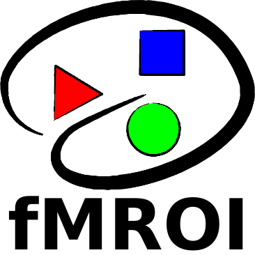

# fMROI

_Software dedicated to create ROIs in fMRI data_

## Description

fMROI is a free software designed to create regions of interest (ROI) in functional magnetic resonance imaging (fMRI). However, it is not limited to fMRI, and can be used with structural images, diffusion maps (DTI), or even with atlases such as FreeSurfer aparc-aseg and Julich atlas. Before running fMROI, ensure that you have installed the dependency packages. 

## Getting Started

### Dependencies

* MATLAB 2018a (or earlier)
* Image Processing Toolbox - MATLAB 
* SPM - Statistical Parametric Mapping 

### Installing

[Download](https://github.com/proactionlab/fmroi) the fMROI source code and add the root folder (./fMROI) to the Matlab path.

Project web page: 
[https://github.com/proactionlab/fmroi](https://github.com/proactionlab/fmroi) 

### Quick Guide

To launch fMROI you just need to type ***fmroi*** in the Matlab comman window. 
To load an image, the users have three alternatives:

1. by clicking on *File>Open Menu*, to open a nifti file (functional, structural, DTI, etc.);
2. by clicking on the menu *File>Load ROI* to open a binary nifti file and automatically use it as ROI;
3. clicking on *File>Load Template* to open one of the templates installed in fMROI. 

After loading the image, users can create and manipulate ROls in the tabs at the bottom of the control panel. 

To create an ROI, the user must click on the *Gen ROI* tab, select the method from the popup menu, adjust the parameters and when ready, click on the *Gen ROI* button. 

After this procedure the generated ROI will appear in the *ROI Table* tab, as well as an image will appear in the list of loaded images (***roi_under-construction.nii***). 

To save the ROls, the user must select the *Bin Mask* checkbox to save each ROI as an independent mask, or *Atlas+LUT* to save all the ROls in the same image and click on the Save button at the bottom of the *ROI Table* tab. 

## Development

Want to contribute? Great! Send an email to *proactiondev@uc.pt*.

## License

GNU GENERAL PUBLIC LICENSE
**Free Software**
 
 

[https://proactionlab.fpce.uc.pt](https://proactionlab.fpce.uc.pt)

-------
default argument names used by roi algoritms:

- hObject - main figure handle.
- srcvol - source volume, a 3D matrix in RAS with the image information.
- curpos - cursor current position, it is a 3D vector with the cursor position in RAS.
- minthrs - handles.slider_minthrs: minimum threshold, srcvol values below the minthrs receive zero; 
- maxthrs - handles.slider_maxthrs: maximum threshold, srcvol values higher than maxthrs receive zero;
