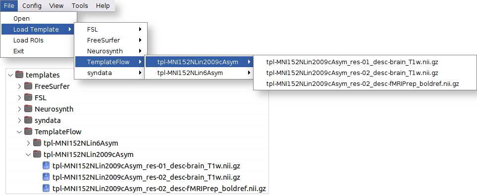

Importing new features
======================

The implementation of fMROI was thoughtfully designed to prioritize user-friendliness and facilitate the integration of new features. This was accomplished through a clear separation between the main GUI implementation and its modules, including ROI creation algorithms, Image templates, and extra tools. By adopting this modular architecture, collaborators can effortlessly contribute new features by embedding them within the fMROI GUI, without requiring a deep understanding of other parts of the fMROI code.

Importing ROI algorithms
------------------------

Importing new ROI algorithms is a powerful feature of fMROI as it facilitates the integration of scripts that previously ran without a GUI and encourages the development of new functionalities. It is important to note that there is no need to worry about programming the GUI for the method to be imported because fMROI includes a generic GUI builder function (autogen_gui) that automatically generates the GUI for you.

**To import a new ROI creation algorithm using fMROI GUI, follow these two simple steps:**

1. Go to the "Config" menu and select "Import ROI function."
2. In the popup window, choose the folder containing the functions to be imported and click the "Open" button. Even if you want to import only one file, it should be placed alone in a folder.

*Importantly, the folder containing the methods to be imported must have exactly the same name as the main method file.*

The folder for importing functions can contain multiple ROI creation algorithms, and each algorithm can consist of multiple files. The fMROI import function will automatically identify the file suffixes (more information about the syntax of ROI creation algorithms can be found in the development section) and place them in the appropriate folders.

If you wish to import a method that does not have a dedicated GUI, meaning the GUI and Caller functions are not available, fMROI provides a generic GUI builder function (autogen_gui.m). In this case, each input argument from the method function generates an editable textbox where users can input the required values.
There are only four exceptions to the input arguments, as fMROI uses specific keywords to convey internal information to the ROI method functions. These keywords are:

1. “srcvol” - the three-dimensional matrix containing the data of the image selected in the control panel;
2. “curpos” - a three-dimensional vector containing the cursor's current position in RAS coordinates;
3. “minthrs” - value indicated in the minimum threshold slider in the image control panel;
3. “maxthrs” -  value indicated in the maximum threshold slider in the image control panel.

When these special keywords are used as input arguments for the ROI method functions, the generic GUI builder does not generate a textbox but instead directly inputs the predefined internal values. This approach simplifies the communication of GUI information to new ROI creation algorithms, relieving developer collaborators from the need to understand GUI programming.

**Alternatively, if you want to import functions without utilizing the fMROI GUI, you can simply copy the folder containing the method functions that you wish to import directly into the `fMROI_root_folder/roimethods` directory**

While it's not mandatory, to maintain consistency with fMROI code organization, we recommend structuring the method functions as follows: place the method functions within a folder `[method name]/methods`, place the GUI creation and caller functions in `[method name]/gui`, and the callback functions in `[method name]/callback`.

*Note: Exercise caution when managing files manually, as improper handling may lead to program crashes.*

Importing image templates
-------------------------

fMROI includes a variety of preinstalled templates that are readily available for use. These templates encompass anatomical images, functional maps, and atlases, offering a comprehensive set of resources. You can load these templates by selecting "File > Load Template".
In addition to the preinstalled templates, fMROI allows you to import new templates, delete existing ones, or restore the default template set.

**To import a set of images as a new template, follow these steps:**

1. Access the menu "Config > Import Template".
2. In the popup window, select the root folder that contains the images you wish to import.
3. Click the "Open" button to proceed.

*Alternatively, if you prefer to import functions without utilizing the fMROI GUI, you can simply save the template folder you want to import directly into the `fMROI_root_folder/templates` directory.*

If the images are organized into subfolders within the root folder, fMROI will automatically create submenus to reflect this structure, making it easier for you to navigate and select the desired templates.

**- To delete all templates, navigate to the "Config" menu and select "Clear template folder".**

**- To restore the default templates, go to the "Config" menu and choose "Restore default templates".**

Importing extra tools
---------------------

The extra tools encompass a collection of functions that are not essential for the core functionality of fMROI but can be highly useful in various tasks (located in the “Tools” menu). By default, fMROI 1.0.x includes a screenshot assistant that allows the automated capture of multiple slices and the generation of image mosaics.

**To import a new tool using fMROI GUI, follow these two simple steps:**

1. Go to the "Config" menu and select "Import tools."
2. In the popup window, choose the folder containing the functions to be imported and click the "Open" button. Even if you want to import only one file, it should be placed alone in a folder.

*Alternatively, if you prefer to import functions without utilizing the fMROI GUI, you can simply save the new tool folder that you want to import directly into the `fMROI_root_folder/tools` directory.*