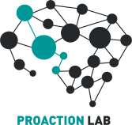

fMROI User Guide
================

**
User-Friendly ROI Creation and Neuroimage Visualization Software
**

fMROI is a powerful and user-friendly software designed to simplify ROI creation and enhance neuroimage visualization. Developed with a focus on ease of use and compatibility, fMROI offers a range of features that make it an ideal tool for researchers and practitioners in the field of neuroimaging. Visit our [github page](https://github.com/peresasc/fmroi) to download fMROI and join us in collaborating on this innovative project.

**Key Features:**

1. **Intuitive Interface:** fMROI provides an intuitive graphical user interface (GUI) that enables users to create complex ROIs with just a few clicks. The interactive design process allows for real-time visualization, saving hours of work and ensuring accuracy.

2. **Compatibility and Flexibility:** With compatibility across different operating systems (Linux, Windows, and MacOS) and the ability to access all ROI creation functions via GUI or command line, fMROI offers flexibility and automation capabilities. Users can create scripts and automate routines.

3. **Collaborative Platform:** Designed as a collaborative platform, fMROI facilitates teamwork and seamless integration of new tools. Its data structure prevents updates to ROI creation algorithms from interfering with the interface, and the software can be easily updated by importing new methods and templates.

***Note:*** *fMROI is continuously improving and expanding its functionality. Stay tuned for future updates, as we strive to enhance the viewer capabilities and incorporate new Matlab toolboxes to further enhance your experience with fMROI.*

 
 

--------
*Maintained by André Peres and collaborators*  
*Bioinformatics Multidisciplinary Environment*  
*Digital Metropolis Institute*  
*Federal University of Rio Grande do Norte*  
*Av. Capitão-Mor Gouveia, S/N – Lagoa Nova*  
*Natal/RN, Brazil – 59078-900*  
[*peres.asc@gmail.com*](mailto:peres.asc@gmail.com)

&nbsp;&nbsp;&nbsp;&nbsp;&nbsp;&nbsp;&nbsp;&nbsp;&nbsp;&nbsp;&nbsp;

