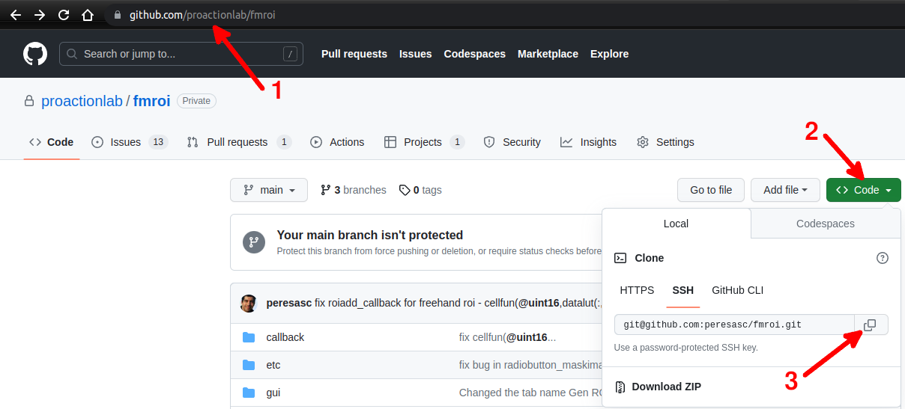

Installation
============

Installing **fMROI** is a simple process that can be done by downloading it directly from GitHub or cloning the folder using Git commands. Cloning the repository allows for easy updates to the software. Before installing fMROI, please ensure that you meet the following requirements:

Dependencies
------------

**SPM12:** SPM12 is a widely-used MATLAB package for fMRI analysis. It can be downloaded for free from the [SPM website](https://www.fil.ion.ucl.ac.uk/spm/software/spm12). After downloading, decompress the file and add the root SPM folder to MATLAB's path. To verify the installation, type "spm" in the MATLAB terminal. If the SPM interface launches, the installation is successful.

**MATLAB Image Processing Toolbox:** The Image Processing Toolbox is a proprietary paid MATLAB package. Most institutions have access to it. You can install it easily using the [MATLAB Add-On Explorer](https://www.mathworks.com/videos/add-on-explorer-106745.html).


fMROI Direct Download Installation:
-----------------------------------

1. Access the fMROI GitHub webpage: [fMROI GitHub webpage](https://github.com/proactionlab/fmroi)

2. Click the "<> Code" button (green button);

3. Select "Download ZIP" to save the compressed file to your computer;

4. Extract the compressed folder in a place you have access in your computer (usually `/home/[user name]/matlab/fmroi` in linux or `C:\Users\[user name]\Documents\matlab\fmroi` in windows). 


Cloning fMROI from GitHub
-------------------------

1. Access the fMROI GitHub webpage: [fMROI GitHub webpage](https://github.com/proactionlab/fmroi)

2. Click the "Code" button (green button) and select your preferred cloning method: "HTTPS", "SSH", or "GitHub CLI". In this guide, we will describe the SSH method.

3. Copy the SSH URL provided.

    

4. Open your preferred Git client and navigate to the desired directory where you want to clone fMROI.

5. Use the following command to clone the repository. Git will prompt you to enter your passphrase (if you set one) to access the private key:

```console
$ git clone git@github.com:proactionlab/fmroi
```

*If you don't have Git installed in your computer or if you are not sure, please check [this simple guide](https://github.com/git-guides/install-git).*

Setting fMROI into MATLAB path
------------------------------

1. In MATLAB, go to the "Home" tab on the ribbon interface and click "Set Path".
2. In the "Set Path" window, click "Add Folder". A new window will open.
3. In the "Add Folder to Path" window, select the folder you extracted (usually fmroi or fmroi-main) and click "Open".
4. Finally, in the "Set Path" window, click "Save".


It is also possible to add the fMROI folder to Matlab’s path by typing the following command in the MATLAB Command window:

```matlab
addpath [path to the fMROI root folder]
```

Examples:

- Windows
```matlab
>>> addpath C:\Users\[user name]\Documents\matlab\fmroi
```

- Linux / MacOS
```matlab
>>> addpath /home/[user name]/matlab/fmroi
```

Running fMROI
-------------

Running fMROI is simple as typing 'fMROI' in MATLAB command window:

```matlab
>>> fmroi
```
