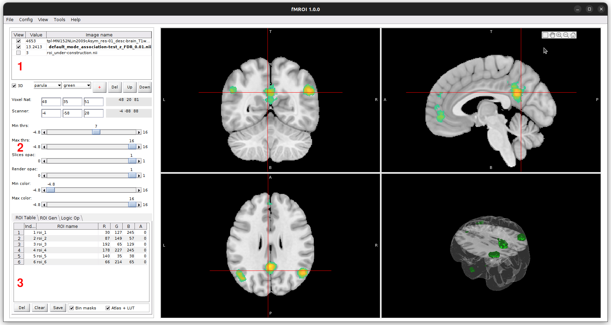
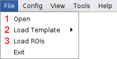
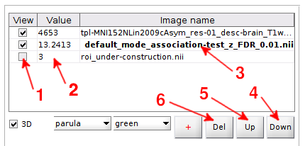
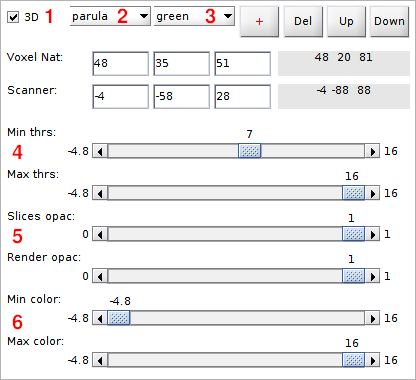
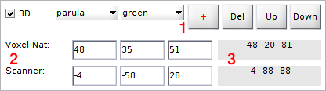
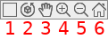
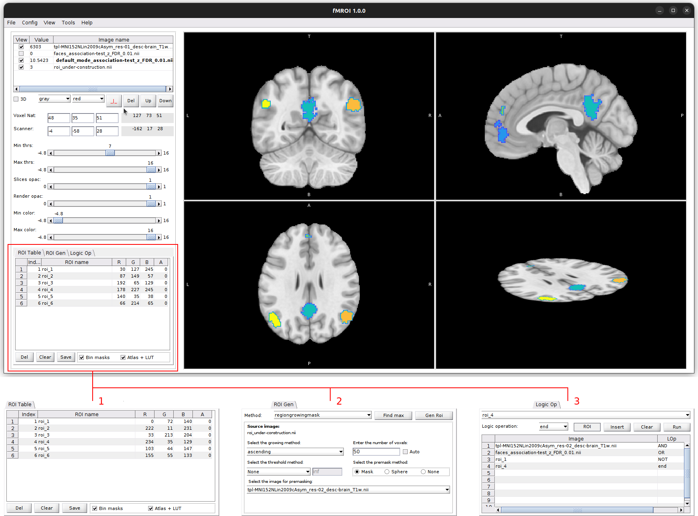

Overview
========

fMROI Graphical User Interface
------------------------------

The fMROI Graphical User Interface (GUI) is designed to provide users with a user-friendly and intuitive experience for creating Regions of Interest (ROIs) and visualizing neuroimages. The GUI consists of three main control sections:

1. **Listing table of loaded images:** In this section, users can view a table listing the loaded images in the order of overlay. It allows for easy selection of images, enabling or disabling their visualization, and provides the ability to view the value of the voxel pointed by the cursor.

2. **Control of image properties:** This section enables users to define various aspects of image visualization. Users have the flexibility to choose colormap, threshold, transparency, cursor position, and stacking order of images. These controls allow for customization and adjustment of the visual representation of the neuroimages.

3. **ROI design and manipulation section:** This section is divided into three tabs: 

    - **ROI Table:** Provides a detailed overview and management of the created ROIs, allowing users to easily modify and organize them.
    - **Gen ROI:** Offers tools and functionalities for generating ROIs, simplifying the complex process with user-friendly options.
    - **Logic Op:** Enables users to perform logical operations on the ROIs, such as combining and selecting regions of interest. This feature enhances the versatility of the software for neuroimage analysis.

The fMROI GUI aims to streamline the workflow of ROI creation and manipulation, providing researchers with an efficient and comprehensive tool for their neuroimage analysis needs.

Loading Images
--------------

fMROI offers three methods for loading images into the software:

1. **Open NIfTI files:** Clicking on "File > Open" opens a window that allows you to select the images you want to load. The images must be three-dimensional NIfTI files (.nii or .nii.gz). If a 4-D NIfTI file is selected, fMROI will display a warning indicating that only the first 3-D volume from the 4-D array will be loaded. You can select multiple files to be opened at once using this method.

2. **Load templates:** By selecting "File > Load Templates," you can choose from a range of preinstalled templates. These templates include anatomical images, functional maps, and atlases.

3. **Load ROIs:** Clicking on "File > Load ROI" opens a window that allows you to select a ROI file. The ROI file should be a three-dimensional NIfTI file (.nii or .nii.gz). Upon loading the ROI file, fMROI generates a temporary image called "roi_underconstruction.nii," and the ROI is displayed in the "ROI Table" tab. If the loaded ROI image contains multiple ROIs (i.e., if the image is not binary), fMROI will convert the image values to positive integers. Each set of non-zero values will be considered as an independent ROI.

After loading an image using any of the three available options, an entry is generated in the fMROI table of loaded images. The image presentation in fMROI is similar to other neuroimage viewers such as FreeView and FSLeyes, where each loaded image is represented as a layer.

1. All the loaded images are stacked on top of each other, and to visualize an image that is below others, you can hide the images on top by unticking the checkbox in the first column next to the image name. Alternatively, you can adjust the transparency by decreasing the opacity in the control of image visualization aspect or thresholding to the top images using the Min and Max threshold controls.
2. The second column of the table displays the pixel values corresponding to the cursor position for each image.
3. To select an image, click its name. The selected image will be displayed in bold.
4. The images are stacked in the order they were loaded, with the most recently loaded image appearing on top. To change the order of the image stack, simply select the desired image and click the "down" button to move it down one level.
5. If you want to move it up, click "up" button to move it up one level.
6. To delete a selected image, click the "Del" button.

*Please note that in the fMROI table of loaded images, the top image is represented by the last line, while the bottom image is represented by the first line.*

Image properties
----------------

**Controls**

1. The viewer consists of 4 axes that display 3 planar slices (axial, coronal, and sagittal) and a volumetric render. However, when loading images in fMROI, the volumetric render is not displayed by default. To generate the image render, simply tick the checkbox labeled "3D". This will create a volume with the regions defined by the minimum and maximum thresholds.
2. To apply a colormap to the planar images, select a colormap from the "colormap" dropdown menu. fMROI provides several default colormaps from Matlab, but you can also load custom colormaps and Lookup tables (LUTs). To load a custom colormap file, choose "custom" from the colormap dropdown menu. A window will appear allowing you to select the .txt or .mat file containing the colormap. The colormap file should be an nx3 RGB array with values between 0 and 255. To load a color LUT, select "LUT" from the "colormap" dropdown menu and choose the LUT file. The LUT file must have fields: 'Index', 'Label_Name', 'R', 'G', 'B', and 'A', and it should be stored in either a .tsv (tab-separated value) or .mat (Matlab table) format. The RGB values must be integers between 0 and 255, and the alpha value (A) should range from 0 to 1.

    Example of Color LUT:

    | Index | Label_Name | R   | G   | B   | A   |
    |-------|------------|-----|-----|-----|-----|
    | 0     | label_1    | 0   | 0   | 0   | 0   |
    | 1     | label_2    | 255 | 255 | 255 | 0   |
    | n     | label_n    | r_n | g_n | b_n | 0   |

3. To select the color for the image render, click the “Render color” dropdown menu and choose the desired color.
4. To define the minimum and maximum thresholds, adjust the "Min thrs" and "Max thrs" slide bars. If the "Min thrs" value is lower than the "Max thrs" value, fMROI will display only those voxels with intensities higher than "Min thrs" AND lower than "Max thrs". Conversely, if the "Min thrs" value is higher than the "Max thrs" value, it will display voxels with intensities higher than "Min thrs" OR lower than "Max thrs".
5. To change the image contrast, i.e., to specify the range of the colormap to be displayed, adjust the “Min color” and “Max color” slide bars.
6. To change the opacity of the planar images, adjust the "Slice opac" slide bar. To modify the opacity of the image render, use the "Render opac" slide bar.

*Please note that only the selected image will be affected by the control changes.*

Navigation and coordinates
--------------------------

- In fMROI, you have multiple ways to change the cursor position and navigate through the image volume:

    - **Clicking the images**: Click with the left mouse button on the desired position in one of the three planar images.
    - **Using arrow keys**: Press the up (&uarr;) or down (&darr;) arrow key to move the coronal plane, left (&larr;) or right (&rarr;) arrow keys to move the sagittal plane, and PgUp or PgDn keys to move the axial plane.
    - **Entering coordinates**: Enter the coordinates in data matrix voxel coordinates or in RAS coordinates in centimeters.

1. To customize the cursor style or hide it: Click the "+" button to toggle between different cursor styles: full cross, small cross, and hide styles.
2. **Cursor Position**: The editable fields display the cursor position based on typed input or clicked position.
3. **Mouse Pointer Position**: The mouse pointer position coordinates are updated when you hover over the planar images.
  

**fMROI also provides axis windowing options. When you hover the mouse over the images, a floating menu will appear in the top right corner.**

1. **Toggle Grid View**: Switch between the grid view (showing four images) and the single view (showing only the selected image).

2. **Rotation tool**: Three-dimensional rotation tool. This tool is enable only for the reder images.

3. **Pan Tool**: Move the images within the display plane. Select the pan tool, click and hold the left mouse button, drag the image to the desired position, and release the left mouse button.

4. **Zoom-in Tool**: Click on a position to zoom-in or select a region to zoom-in by clicking and holding the left mouse button and moving the pointer to another position.

5. **Zoom-out Tool**: Click on the image to zoom-out.

6. **Restore Default Visualization**: Restore the default visualization settings.

*Attention: After using a tool from the floating menu, click it again to disable its function.*

ROI design and manipulation
---------------------------

fMROI offers an intuitive interface that makes it easy to create and manipulate ROIs. The ROI creation section is divided into three user-friendly tabs, each providing different functionalities. Users can conveniently design their ROIs while instantly observing real-time changes in the results, ensuring a smooth and efficient ROI creation process. Creating ROIs in fMROI can be as simple as:

1. Clicking on the desired position or directly entering coordinates in the navigator to select the center of the ROI.
2. Choosing the desired ROI type (e.g., spherical, cubic, region-growing) and specifying parameters like radius or number of voxels.
3. Clicking a button to generate the ROI.
It is also easy to combine ROIs or calculate the conjunction between them in the logical operations tab.

**1. ROI table tab**

In the first tab, you will find a list of under-construction ROIs. The ROI Table in this tab allows you to manually assign ROI indices, names, colors (RGB values), and transparency (A). You can easily edit the ROI Table to customize your ROIs according to your requirements.

Once you have completed creating the ROIs, you have two options for saving them:

- Save as Independent Binary NIfTI Files: By ticking the "bin masks" option, you can save each ROI as an independent binary NIfTI file. This option is useful when you need individual ROIs for further analysis or visualization.

- Save as Atlas + LUT: By ticking the "Atlas + LUT" option, you can save the ROIs in a single NIfTI file with different indices. This format combines an atlas-like image with a lookup table that contains ROI Table values. This option is helpful when you want to store multiple ROIs in a compact manner.

**2. ROI Generation tab (Gen ROI)**

The second tab provides tools for generating ROIs using different algorithms. Start by selecting an algorithm from the Method dropdown menu. Once you select an algorithm, its specific interface for setting the parameters will be displayed.

Pay attention to the "Find Max" button, which helps you identify the voxel with the highest value based on the selected algorithm and its parameters. It's worth noting that the search is limited to the ROI defined by the interface parameters, even if no ROI is created practically. This feature assists in exploring potential regions of interest within your data.

**3. Logical Operations tab (Logic Op)**

The third tab enables performing logical operations between ROIs. You can create complex combinations of ROIs using logical operators. Let's consider the example ilustrated in the figure above:

- Conjunction (AND): Combine two loaded images using the conjunction operation.
- Disjunction (OR): Perform a logical OR operation between the previous conjunction output and an under-construction ROI.
- Conjunction with Negation (NOT): Finally, combine the previous output with the negation of another under-construction ROI using the conjunction operator.

*It is worth noting that fMROI allows you to perform logical operations between both loaded images and under-construction ROIs. If the loaded images are not binary, they are automatically converted into binary format using the [img2mask](roi_creation.md#img2mask) algorithm, which considers the selected minimum and maximum thresholds.*

