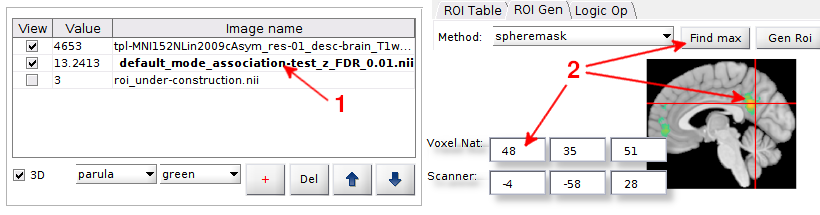
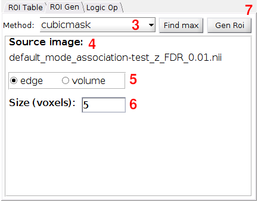
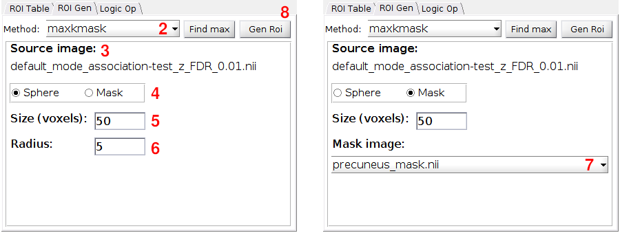
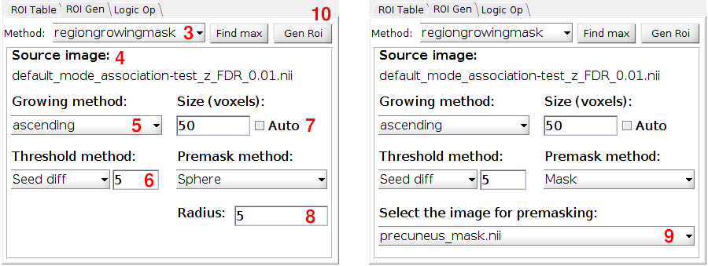
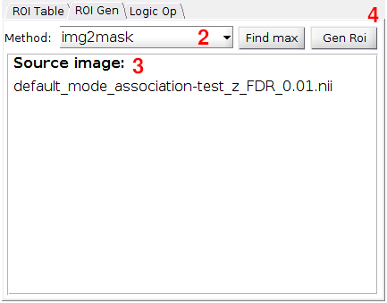
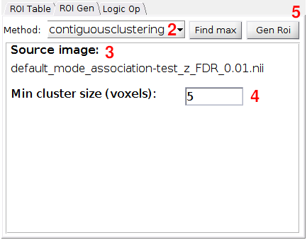
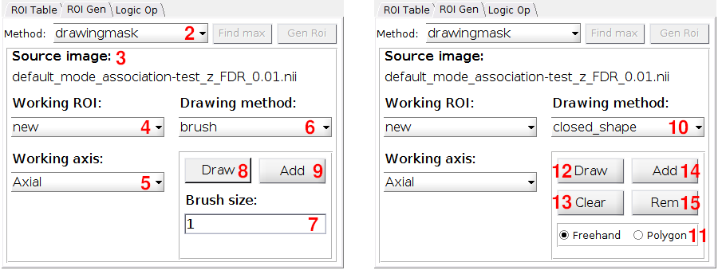

ROI Creation
============

fMROI provides a user-friendly interface for creating and manipulating ROIs. In this guide, we will walk you through the process of creating ROIs using the fMROI software.

- **Glossary of the variables**

    - **curpos:** Refers to current position, that here is the cursor position.
    - **srcvol:** Source volume, i.e., the volumetric image used to calculate the ROIs.
    - **nvoxels:** Number of voxels. It relates to radius/edge size or number of voxels inside an ROI.
    - **premask:** Binary volumetric image used to constrain the region to be analyzed.
    - **seed:** Source image coordinate (usually *curpos*) used for some calculation.
    - **minthrs:** Minimum threshold intensity. It can be defined in the “Min thrs” slider.
    - **maxthrs:** Maximum threshold intensity. It can be defined in the “Max thrs” slider.
  

### Source image and cursor position

For all ROI creation algorithms in fMROI, the source image (srcimg) must be chosen by clicking on the name of the corresponding image in the table of loaded images (shown in bold).

Spheremask
----------

Spheremask creates a spherical mask centered on *curpos* with the same dimension as *srcvol* with radius/volume equal to *nvoxels*. The mask is a binary array where the elements that belong to the sphere mask are set to 1 and all other voxels are set to 0.
 
- **Syntax:**

    - *mask = spheremask(srcvol, curpos, nvoxels, mode)*

 
- **Inputs:**

    - **srcvol:** 3D matrix, usually a data volume from a nifti file.
    - **curpos:** Position where the sphere mask will be centered.
    - **nvoxels:** Radius or Volume size in voxels.
    - **mode:** String with the keywords 'radius' or 'volume' that defines if *nvoxels* is the number of voxels that compose the ROI (volume) or the radius size (radius).

- **Output:**

    - **mask:** Binary 3D matrix with the same size as *srcvol*. 
   

 **Steps for creating ROIs in the fMROI GUI:**

1. Select the source image by clicking its name in the [table of loaded images](#source-image-and-cursor-position);
2. You can choose the coordinates of the sphere center in one of the [following ways](#source-image-and-cursor-position):
    - Click on the image at the desired position.
    - Enter the coordinates in the editable textbox labeled "Voxel Nat" coordinates or "Scanner" coordinates.
    - Click the "Find max" button to search for the voxel with the highest intensity in the selected region.
4. Verify that the selected image is displayed in the source image field.
5. Determine whether the ROI size will be defined by the radius (number of voxels in the radius) or volume (total number of voxels within the ROI). Please note that when selecting the ROI size based on volume, the spheremask algorithm will attempt to create an ROI that closely resembles a sphere, although it may be less "spherical-shaped" compared to ROIs generated using the radius method.
6. Enter the desired number of voxels to define the ROI size in the editable textbox "Size (voxels)".
7. Click the "Gen ROI" button to generate the ROI. You can review and edit the ROI properties in the "ROI table" tab, and modify the visualization properties by selecting the "under-construction" option in the table of loaded images and adjusting its visualization settings.

Cubicmask
----------

Cubicmask creates a cubic mask centered on *curpos* with the same dimension as *srcvol* with edge/volume equal to *nvoxels*. The mask is a binary array where the elements that belong to the cubic mask are set to 1 and all other voxels are set to 0.
 
- **Syntax:**

    - *mask = cubicmask(srcvol, curpos, nvoxel, mode)*
 
- **Inputs:**

    - **srcvol:** 3D matrix, usually a data volume from a nifti file. 
    - **curpos:** Position where the cubic mask will be centered. 
    - **nvoxels:** Edge or Volume size in voxels. 
    - **mode:** String with the keywords 'edge' or 'volume' that defines if *nvoxels* is the number of voxels that compose the ROI (volume) or the edge size (edge). 

- **Output:**

    - **mask:** Binary 3D matrix with the same size as *srcvol*. 

1. Select the source image by clicking its name in the [table of loaded images](#source-image-and-cursor-position);
2. You can choose the coordinates of the cube center in one of the [following ways](#source-image-and-cursor-position):
    - Click on the image at the desired position.
    - Enter the coordinates in the editable textbox labeled "Voxel Nat" coordinates or "Scanner" coordinates.
    - Click the "Find max" button to search for the voxel with the highest intensity in the selected region.
3. Choose "cubicmask" from the "Method" dropdown menu.
4. Verify that the selected image is displayed in the source image field.
5. Determine whether the ROI size will be defined by the number of voxels in the cube edge or by the cube volume, i.e., the number of voxels within the ROI. Please note that when selecting the ROI size based on volume, the cubicmask algorithm will attempt to create an ROI that closely resembles a cube, although it may be less perfectly "cubic-shaped" compared to ROIs generated using the edge size method.
6. Enter the desired number of voxels to define the ROI size in the editable textbox "Size (voxels)".
7. Click the "Gen ROI" button to generate the ROI. You can review and edit the ROI properties in the "ROI table" tab, and modify the visualization properties by selecting the "under-construction" option in the table of loaded images and adjusting its visualization settings.

Maxkmask
--------

Maxkmask searches for the *kvox* highest-intensity voxels of the *srcvol* contained in the region defined by *premask*. 

- **Syntax:**

    - *mask = maxkmask(srcvol, premask, kvox)*

- **Inputs:**

    - **srcvol:** 3D matrix, usually a data volume from a nifti file. 
    - **premask:** Binary 3D matrix with same size as *srcvol*. If premask is not a binary matrix, maxkmask will consider as ROI all non-zero elements. 
    - **kvox:** Integer that defines the number of non-zero elements in mask. 

- **Output:**

    - **mask:** Binary 3D matrix with the same size as *srcvol*. 
 

1. Select the source image by clicking its name in the [table of loaded images](#source-image-and-cursor-position);
2. Choose "maxkmask" from the "Method" dropdown menu.
3. Verify that the selected image is displayed in the source image field.
4. Determine the *premask* method to constrain the region to be analyzed (Sphere or Mask image).
5. Enter the desired number of voxels to define the ROI size in the editable textbox "Size (voxels)".
6. If you selected "Sphere" in step `4`, enter the number of voxels for the premask radius. The center of the spherical premask is determined by the cursor position (curpos).
7. If you selected "Mask image" in `4`, choose the image to be used as the mask from the "Mask image" dropdown menu. The images listed in the "Mask image" dropdown menu are the ones displayed in the [table of loaded images](#source-image-and-cursor-position).
8. Click the "Gen ROI" button to generate the ROI. You can review and edit the ROI properties in the "ROI table" tab, and modify the visualization properties by selecting the "under-construction" option in the table of loaded images and adjusting its visualization settings.

Regiongrowingmask
-----------------

Regiongrowingmask is a region growing algorithm that groups neighboring voxels from a *seed* iteratively according to a rule. The regiongrowingmask has three rules for growing (grwmode), ascending, descending and similarity to the *seed*, and three other rules for stopping growth, maximum number of voxels (*nvox*), region set by a mask (*premask*), and maximum difference in values between the *seed* and its neighbors (*diffratio*).

- **Syntax:**

    - *mask = regiongrowingmask(srcvol, seed, diffratio, tfMean, grwmeth, nvox, premask)* 

- **Inputs:**

    - **srcvol:** 3D matrix, usually a data volume from a nifti file. 
    - **seed:** 3D integer vector with the initial position for the growing algorithm. 
    - **diffratio:** Scalar that defines the maximum magnitude difference of the neighborhood with respect to the seed, i.e.: 
    \|neighbor_mag - seed_mag\| =< \|diffratio\|. 
    - **grwmode:** String - Defines de growing mode:
        - *'ascending'* - searches for the neighbor with the maximum value every each iteration. 
        - *'descending'* - searches for the neighbor with the minimum value every each iteration. 
        - *'similarity'* - searches for the neighbor with the most similar value to the seed. 

    - **nvox:** Integer that defi   nes the maximum number of voxels in ROI. 
    - **premask:** Binary 3D matrix with same size as *srcvol* that defines the region where the region growing will be applied. If premask is not a binary matrix, regiongrowingmask will binarize it considering TRUE all non-zero elements. 

- **Outputs:**

    - **mask:** Binary 3D matrix with the same size as *srcvol*. 
 

1. Select the source image by clicking its name in the [table of loaded images](#source-image-and-cursor-position);
2. You can choose the coordinates of the seed in one of the [following ways](#source-image-and-cursor-position):
    - Click on the image at the desired position.
    - Enter the coordinates in the editable textbox labeled "Voxel Nat" coordinates or "Scanner" coordinates.
    - Click the "Find max" button to search for the voxel with the highest intensity in the selected region.
3. Choose "regiongrowingmask" from the "Method" dropdown menu.
4. Verify that the selected image is displayed in the source image field.
5. From the "Select the growing method" dropdown menu, choose region growing mode (*grwmode*): 'ascending', 'descending', or 'similarity'.
6. Select "Seed diff" from the "Select the threshold method" dropdown menu and enter the *diffratio* value. This value determines the maximum intensity difference between the seed and its neighbors, and it is used to stop the ROI growth. Alternatively, choose "None" from the dropdown menu if you do not want to use a *diffratio* threshold method.
7. Enter the desired number of voxels to define the ROI size in the editable textbox "Enter the number of voxels". If you want the ROI growth to stop based solely on the diffratio value, tick the checkbox "Auto".
8. Determine the *premask* method to constrain the region to be analyzed (Sphere or Mask image). If you selected "Sphere", enter the number of voxels for the premask radius. The center of the spherical premask is determined by the cursor position (curpos).
9. Alternatively, if you selected "Mask image" as *premask* method, choose the image to be used as the mask from the "Mask image" dropdown menu. The images listed in the "Mask image" dropdown menu are the ones displayed in the [table of loaded images](#source-image-and-cursor-position).
10. Click the "Gen ROI" button to generate the ROI. You can review and edit the ROI properties in the "ROI table" tab, and modify the visualization properties by selecting the "under-construction" option in the table of loaded images and adjusting its visualization settings.

Img2mask
--------

Img2mask creates a mask determined by the *minthrs* and *maxthrs* intensity thresholds. If *minthrs* is lower than *maxthrs*, img2mask set to zero those voxels that have values that are lower than *minthrs* and bigger than *maxthrs*, i.e., *mask = srcvol >= minthrs & srcvol <= maxthrs*. Otherwise, if *minthrs* is bigger than *maxthrs*, img2mask set to zero those voxels that have values lower than *minthrs* and bigger that *maxthrs*, i.e., *mask = srcvol >= minthrs | srcvol <= maxthrs*;

- **Syntax:**

    - *mask = img2mask(srcvol, minthrs, maxthrs)* 

- **Inputs:**

    - **srcvol:** 3D matrix, usually a data volume from a NIfTI file. 
    - **minthrs:** Scalar - Minimum threshold intensity. 
    - **maxthrs:** Scalar - Maximum threshold intensity. 

- **Outputs:**

    - **mask:** Binary 3D matrix with the same size as *srcvol*.

 

1. Select the source image by clicking its name in the [table of loaded images](#source-image-and-cursor-position);
2. Choose "img2mask" from the "Method" dropdown menu.
3. Verify that the selected image is displayed in the source image field and if the minimum (minT) and maximum (maxT) intensity thresholds are correct. The *srcimg* regions displayed in the viewer will be converted in a binary mask. 
4. Click the "Gen ROI" button to generate the ROI. You can review and edit the ROI properties in the "ROI table" tab, and modify the visualization properties by selecting the "under-construction" option in the table of loaded images and adjusting its visualization settings.

Contiguousclustering
--------------------

Contiguousclustering group contiguous volxels (if their faces touch). If *minthrs* is lower than *maxthrs*, contiguousclustering consider as input those voxels that have values that are lower than *minthrs* and bigger than *maxthrs*. Otherwise, if *minthrs* is bigger than *maxthrs*, it considers those voxels that have values lower than *minthrs* and bigger that *maxthrs*. All clusters that have less elements than mincltsz are eliminated.

- **Syntax:**

    - *mask = contiguousclustering(data, minthrs, maxthrs, mincltsz)* 

- **Inputs:**

    - **srcvol:** 3D matrix, usually a data volume from a nifti file. 
    - **minthrs:** Scalar - Minimum threshold intensity. 
    - **maxthrs:** Scalar - Maximum threshold intensity. 
    - **mincltsz:** Scalar - Minimum cluster size, clusters that have less elements than mincltsz are eliminated. 

- **Outputs:**

    - **mask:** Integer 3D matrix with the same size as *srcvol*. The non-zero values of mask are the indexes of each clusters.

 

1. Select the source image by clicking its name in the [table of loaded images](#source-image-and-cursor-position);
2. Choose "contiguousclustering" from the "Method" dropdown menu.
3. Verify that the selected image is displayed in the source image field and ensure that the minimum (minT) and maximum (maxT) intensity thresholds are correct. The srcimg regions displayed in the viewer will be converted into an index mask, where each non-contiguous region is assigned a positive integer index.
4. In the editable textbox "Minimum cluster size (voxels)", enter the cluster-size threshold (mincltsz). This threshold eliminates clusters that have fewer elements than mincltsz.
5. Click the "Gen ROI" button to generate the ROI. You can review and edit the ROI properties in the "ROI table" tab, and modify the visualization properties by selecting the "under-construction" option in the table of loaded images and adjusting its visualization settings.

Drawingmask
----------

Drawingmask is a tool for generating ROIs from freehand drawings layer by layer over planar images. This tool does not have a standalone version, so it works only alongside the fMROI graphical interface.

- **Settings:**

    - **Source image:** Selected image in the list of loaded images. 
    - **Working ROI:** defines where the drawn ROI will be placed.
        - *'new'* - create a new ROI variable and list it in ROI table. 
        - *'roi_name'* - place the drawn ROI over the selected ROI (listed in ROI Table). 

    - **Working axis:** defines in which planar image the ROI draw will take place (Axial, Coronal or Sagittal). 

    - **Drawing method:** defines which method will be used to draw the ROI.
        - *Brush* - in this method it is necessary to click and hold the left mouse button while drawing the ROI outline. 
        - *Closed shape* - in this method the vertices are created clicking the left mouse button. Double-click to close the polygon. 

    - **Drawing tools:** Tools for creating/editing ROI drawings.
        - *Draw* - Enable drawing the ROI in the specified axis. 
        - *Clear* - Clears the current ROI drawing. 
        - *Add* - Converts the current draw in a mask and insert it into the selected ROI. The mask index will be 1 if 'working ROI' is 'new' otherwise it will be the highest value of the selected ROI. 
        - *Rem* - Fills with zeros the drawn ROI and updates the selected ROI.

 

1. Select the source image by clicking its name in the [table of loaded images](#source-image-and-cursor-position);
2. Choose "drawingmask" from the "Method" dropdown menu.
3. Verify that the selected image is displayed in the source image field. 
4. From the "Select the working ROI" dropdown menu, select the ROI that you want to modify. In case you want to create a new ROI, selec "new".
5. From the "Select the working axis" dropdown menu, select the axis in what you want to draw. If you want to draw in multiple axis, add the draw from one axis, change the "Select the working axis" to desired axis, and add the new draw to the same ROI.
6. From the "Select the drawing method" dropdown menu, select the drawing tool "brush" or "closed_shape". The items from `7` to `9` refer to the drawing method "brush". If you are interest in "closed_shape" method, skip to item `10`.
7. If you selected "brush", you can enter the brush size in the editable textbox "Brush size". The brush has circular shape and "Brush size" defines its radius in voxels.
8. For start drawing, click the toggle button "Draw" that will become red to indicate that it is active. In the "Select the working axis" click with left mouse button to start drawing or right mouse button to erase. *Note that if you change the slice that you are drawing before adding it to an ROI, your drawing will be deleted*.
9. When your ROI draw is done, click the "Add" button. Then the ROI layer that you drew is added to the Selected working ROI. If you selected "new", then a new ROI will be created with index iqual to the highest index + 1.
10. If you want to draw using the "closed_shape" method select it from "Select the drawing method" dropdown menu.
11. Select the drawing mode "Freehand" (draw the entire path) or "Polygon" (draw vertices of a polygon).
12. For start drawing, click the button "Draw". In the "Select the working axis" click with . If you selected the "Freehand" mode, click and hold the left mouse button to draw a closed shape and realease the left mouse button when it is done. If you selected the "Polygon" mode, click the left mouse button to create the vertices of a polygon, each vertice is conected with the previous with a line. To close the drawing shape, double click in the last desired vertice ok click the first vertice.
13. Click the the button "Clear" to delete a closed shape. Note that it will delete the drawn path and will note affect the selected ROI.
14. When you finished drawing the closed shape, click the "Add" button. Then the ROI layer that you drew is added to the Selected working ROI. If you selected "new", then a new ROI will be created with index iqual to the highest index + 1.
15. You can also erase the area define by the drawn closed shape by click the "Rem" button.

*You can review and edit the ROI properties in the "ROI table" tab, and modify the visualization properties by selecting the "under-construction" option in the table of loaded images and adjusting its visualization settings.*
